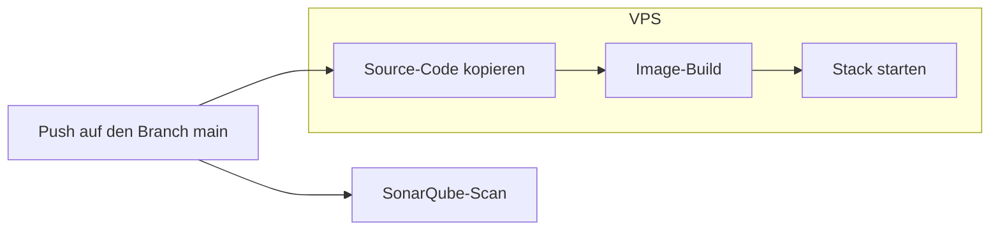

# Koch mit deinem Kühlschrank - Rezepte für deine Reste *(Captain Cook)*
Dokumentation für das Projekt *Captain Cook* im Rahmen des Kurses *Advanced Software Engineering* 2022 (DHBW Mannheim)
Gruppenmitglieder: Arne Kapell, Finn Callies, Irina Jörg, Akshaya Jeyaraj, Gurleen Kaur Saini
---

# Inhaltsverzeichnis
- [Koch mit deinem Kühlschrank - Rezepte für deine Reste *(Captain Cook)*](#koch-mit-deinem-kühlschrank---rezepte-für-deine-reste-captain-cook)
  - [Gruppenmitglieder: Arne Kapell, Finn Callies, Irina Jörg, Akshaya Jeyaraj, Gurleen Kaur Saini](#gruppenmitglieder-arne-kapell-finn-callies-irina-jörg-akshaya-jeyaraj-gurleen-kaur-saini)
- [Inhaltsverzeichnis](#inhaltsverzeichnis)
  - [Motivation](#motivation)
    - [Akteure](#akteure)
  - [Architektur](#architektur)
    - [Komponentendiagramm](#komponentendiagramm)
    - [Konzept: Externer ID-Provider](#konzept-externer-id-provider)
    - [Konzept: DB-Zugriff absichern](#konzept-db-zugriff-absichern)
    - [Architektur-Entscheidungen](#architektur-entscheidungen)
    - [Funktionale Anforderungen](#funktionale-anforderungen)
    - [Nicht-funktionale Anforderungen](#nicht-funktionale-anforderungen)
    - [Domain-Driven-Design](#domain-driven-design)
      - [API](#api)
    - [Observability](#observability)
    - [Weitere Diagramme](#weitere-diagramme)
  - [Deployment und Operations](#deployment-und-operations)
    - [Deployment](#deployment)
      - [Build \& Deployment Pipeline](#build--deployment-pipeline)
    - [Operations](#operations)
    - [Statischer Code-Report](#statischer-code-report)

## Motivation
---
Die grundsätzliche Motivation des Projektes besteht darin dazu beizutragen, die Lebensmittelverschwendung zu verringern. Dies erfolgt indem z. B. Rezepte vorgeschlagen werden, die auf den zu Hause verbliebenen Resten basieren, und die Menschen durch leckere Rezeptempfehlungen dazu ermutigt, diese zu verwerten.

Oft bereiten Kunden eine Mahlzeit mithilfe von Koch-Websites oder Kochbüchern zu. Doch nicht immer haben sie die benötigten Zutaten zur Hand. Daher basieren die Empfehlungen des Empfehlungssystems auf Produkten, die der Kunde entweder zu Hause im Kühlschrank und im Vorratsschrank hat oder die er gerade im örtlichen Supermarkt gekauft hat. Sollte doch einmal etwas fehlen, lassen sich einzelne Zutaten direkt auf die Einkaufsliste setzen, sodass die bereits vorhandenen optimal genutzt werden können.

### Akteure
<!-- TODO -->

## Architektur
---

### Komponentendiagramm

Die Architektur der Anwendung ist im oberen Diagramm dargestellt. Die Anwendung besteht aus einem Backend, welches in Python mit dem Flask-Framework implementiert wurde. Das Backend stellt eine REST-API zur Verfügung, die von einem Frontend aus genutzt wird. Das Frontend wurde dabei mit dem Flutter-Framework implementiert. Die Daten werden in einer MariaDB-Datenbank gespeichert und die Kommunikation zwischen den Komponenten erfolgt über HTTP-Requests.

Zusätzlich zu den Komponenten der Anwendung gibt es noch einen externen ID-Provider, der für die Authentifizierung der Benutzer zuständig ist. Die Kommunikation zwischen dem Frontend und dem ID-Provider erfolgt über OAuth2. Die erhaltenen Tokens werden von dem Backend für die Authentifizierung der Benutzer mit Hilfe der selben OAuth2-Schnittstelle validiert.

<!-- TODO: einzelne Komponenten genauer beschreiben -->

### Konzept: Externer ID-Provider
Wie bereits im [Komponentendiagramm](#komponentendiagramm) beschrieben, wird für die Authentifizierung der Benutzer ein externer ID-Provider verwendet. Konkret fiel die Entscheidung zu Gunsten von Google als ID-Provider aus, da hier eine große Anzahl an bereits registrierten Benutzern vorhanden ist und die Anbindung mit Hilfe bestehender Bibliotheken und Standard-Schnittstellen sehr einfach ist. Die Anbindung erfolgt über die OAuth2-Schnittstelle, die von Google bereitgestellt wird.

Im Frontend (Flutter) wird das Dart-Package [google_sign_in]([https://pub.dev/packages/google_sign_in) verwendet, um die Anmeldung zu ermöglichen und den aktuellen Status des Benutzers vorzuhalten. 
Auf der API-Seite (Flask) wird das Python-Package wird der Token aus dem Frontend überprüft und die Authentizität des Benutzers und seiner Session geprüft.

Dieses Konzept erlaubt es der Anwendung ohne eigenes Session-Management auszukommen, was den Aufwand für die Implementierung deutlich reduziert. Außerdem ist es möglich, die Anwendung mit einem bestehenden Google-Account zu nutzen, was die Anmeldung vereinfacht. Schließlich führt diese Entscheidung auch zur Reduktion der Angriffsfläche, da die Anwendung nicht selbst für die Authentifizierung der Benutzer verantwortlich ist und somit nicht selbst die Passwörter der Benutzer speichern muss.

### Konzept: DB-Zugriff absichern
Um die Datenbank von unerlaubten Zugriffen zu schützen, werden die Vorteile im Container-Umfeld genutzt. Dafür lohnt sich ein Blick in die [Definition des Docker-Stacks (für die Produktiv-Umgebung)](../docker-compose.prod.yml). Vereinfacht lässt sich sagen, dass dort zwei Netzwerke existieren: ein Stack-internes (`default`) und eines für die Kommunikation nach außen (`web`). Die Datenbank ist nur im internen Netzwerk erreichbar, sodass sie nicht von außen direkt angesprochen werden kann. Die Kommunikation zwischen dem Backend und der Datenbank erfolgt über das interne Netzwerk. 

### Architektur-Entscheidungen
*Warum Flask, Flutter und MariaDB? (Vergleich zu anderen Stacks)*
Es gibt viele Faktoren, die die Architekturentscheidungen in einem Projekt beeinflussen können, darunter die spezifischen Anforderungen des Projekts, die Fähigkeiten und Erfahrungen des Entwicklungsteams und die verfügbaren Ressourcen. Im Allgemeinen ist es jedoch wichtig, die verschiedenen Optionen sorgfältig zu berücksichtigen und die Werkzeuge und Technologien auszuwählen, die am besten für das anstehende Projekt geeignet sind.

Eine mögliche Architektur für ein Projekt könnte den Einsatz von Flutter für die Front-End, Flask für die Back-End und MariaDB für die Datenbank beinhalten.

Flutter ist ein beliebtes Open-Source-Mobile-Application-Development-Framework von Google. Es ermöglicht Entwicklern, native kompilierte Anwendungen für Mobilgeräte, Web und Desktop aus einem Codebasis zu erstellen. Flutter ist bekannt für seinen schnellen Entwicklungszyklus und seine Fähigkeit, schöne und expressive Benutzeroberflächen zu erstellen.

Flask ist ein Microweb-Framework für Python, das eine einfache Möglichkeit bietet um Webanwendungen zu erstellen. Es ist bekannt für seine Einfachheit und seine Flexibilität, wodurch es eine gute Wahl für das schnelle Entwickeln von Prototypen und die Erstellung kleiner bis mittelgroßer Webanwendungen ist. Flask verfügt desweiteren über eine große und aktive Community, mit vielen Bibliotheken und Plugins von Drittanbietern, die seine Fähigkeiten erweitern. Es wird verwendet, um eine API zu erstellen, die die Datenbank abfragt und die Daten an die App sendet, in der diese dann angezeigt werden. 

MariaDB ist ein Fork des beliebten Datenbank-Management-Systems MySQL. Es ist bekannt für seine Kompatibilität mit MySQL sowie für seine Leistung und Zuverlässigkeit. MariaDB bietet eine Vielzahl von Funktionen und Werkzeugen zur Verwaltung und Abfrage von Daten und ist daher für viele Anwendungen geeignet.

Zusammen bieten diese Technologien eine leistungsstarke und flexible Architektur für unser Projekt. Flutter kann verwendet werden, um benutzerfreundliche und ansprechende Interfaces zu erstellen. Flask bietet einen einfachen und skalierbaren Back-End und MariaDB kann als zuverlässige und leistungsstarke Datenbank dienen.

### Funktionale Anforderungen
*Use-Cases*

Für die funktionalen Anforderungen wurden vier Use-Cases 
definiert. Diese sind:
- Die Anwendung muss es Benutzern ermöglichen, Rezepte abzufragen.
- Die Anwendung muss es Benutzern ermöglichen, Bewertungen für Rezepte hinzuzufügen.
- Die Anwendung muss es Benutzern ermöglichen, eine Einkaufsliste zu benutzen/bearbeiten.
- Die Anwendung muss es Benutzern ermöglichen, sich an- und abzumelden.

*User Stories*

- Als User möchte ich mit der Anwendung Rezeptvorschläge abfragen, um Lebensmittelverschwendung durch Wiederverwertung von zu Hause verbliebenen Resten zu verringern.

- Als User möchte ich Rezepte bewerten, um meine Meinung zum Rezept sowie Verbesserungsvorschläge dazu mit anderen Nutzern der Anwendung auszutauschen.

- Als User möchte ich eine Einkaufsliste verwenden, um nicht vorhandene Zutaten hinzuzufügen, womit ich mir Zeit und Geld sparen und Lebensmittelverschwendung vorbeugen kann.

- Als User möchte ich  die Möglichkeit haben mich an- und abzumelden, um Funktionen wie das Hinzufügen von Bewertungegn und Erstellung einer Einkaufsliste nutzen zu können.

### Nicht-funktionale Anforderungen
*Skalierbarkeit, Authorization, jeweils mit Implementierung*

Die genutzen Container-Technologien ermöglichen ein einfaches Skalieren von UI und API. 

Um registrierten Nutzern eine Datensichherheit zu bieten wird HTTPS für für Basis-Verschlüsselung zwischen Client und Server (UI und API) genutzt.
Um weitere (Web-)Schwachstellen abzudecken, soll sich an der OWASP Top 10 als Katalog orientiert.
  
Eine weitere wichtige Nicht-funktionale Anforderung ist die Benutzerfreundlichkeit. Diese soll durch eine intuitive, einfache und übersichtliche UI umgesetzt werden. Daraus resultierend soll auch der Funktionsumfang auf das minimale beschränlkt werden.
### Domain-Driven-Design
*EDA (Event-Driven-Architecture), SOA (Service-Oriented-Architecture)*

Wie veranschaulicht besteht das Domain Driven Design aus 3 Domains: Rezept-Daten, Einkaufsliste und Such-Domäne(Such-Ausgabe). Das Modell für die Rezept-Daten ist in der Datei recipe.py zu finden. In der Datei shopping_list.py ist das Modell für die Einkaufsliste zu finden und die Datei recommendation_system.py enthält das Modell für die Such-Ausgabe.

 
 #### API
Die API liefert abhängig von der erhaltenen Such-Eingabe, Rezepte zurück sowie einen Ähnlichkeitswert. Aktuell bedient sich die API dabei an einem Datensatz fester Größe, der etwa 2000 Rezepte umfasst. Um Rezeptempfehlungen zu geben wird die Ähnlichkeit zwischen den Rezepten und der Such-Eingabe ermittelt. Hierfür wird die Cosinus-Ähnlichkeit genutzt. Die Cosinus-Ähnlichkeit ist ein Maß für die Ähnlichkeit zwischen zwei Vektoren. Sie ist definiert zwischen zwei Vektoren a und b als: cos(a,b) = a*b / (|a|*|b|). Dabei ist a*b die Skalarprodukt von  a und b und |a| die Länge des Vektors a und |b| die Länge des Vektors b. Dabei wird ein Vektor jeweils durch ein Rezept aus dem Datensatz repräsentiert und der andere durch die Such-Eingabe. 

Um die Rezepte als Vektor zu repräsentieren, wird jede Zutat eines Rezeptes als eine Komponente des Vektors dargestellt. Um diese Darstellung zu ermöglichen wurde der TF-IDF Vectorizer verwendet. Dieser berechnet die Term-Frequency (TF) und die Inverse Document Frequency (IDF) für jede Zutat eines Rezeptes. Es wird also somit jeder Zutat ein Gewicht, abhängig von der Häufigkeit, der Zutat im spezifischen Rezept und der Häufigkeit in allen Rezepten. Somit wird garantiert dass, auch nicht häufig vorkommende Zutaten berücksichtigt werden. Auf diese weise wurde ein TF-IDF-Modell trainiert, dass allen Zutaten eine Gewichtung nach deren Relevanz zugeordnet. Im weitern Verlauf kann dieses Modell dazu trainiert werden auch Allergien und Intoleranzen eines Nutzers zu berücksichtigen, indem die Gewichtung der Zutaten entsprechend angepasst wird bzw. auf 0 gesetzt wird. So würden dann z.B. die Milchprodukte bei einem Laktoseintoleranten Nutzer eine niedrigere Gewichtung erhalten und die Wahrscheinlichkeit, dass ein Rezept mit Milchprodukten empfohlen wird, würde sinken. Allerdings ist dies nicht Kernfunktion des Systems und wurde daher noch nicht implementiert. Die erhaltene Gewichtung der Zutaten wird dann in einem Vektor umgewandelt, der die Rezepte repräsentiert. Auch die Such-Eingabe wird auf diese Weise in einen Vektor umgewandelt.
Anschließend kann die Cosine Similarity zwischen allen Rezpten und der Such-Eingabe berechnet werden. Desto geriner der Cosinus-Winkel zwischen den Vektoren ist, desto größer ist die Ähnlichkeit. Die Rezepte mit der höchsten Cosinus-Ähnlichkeit werden dann als Such-Ausgabe zurückgegeben und sind absteigend sortiert.
Für die Berechnung der Cosinus-Ähnlichkeit wird die Funktion cosine_similarity aus dem sklearn.metrics.pairwise Modul verwendet. 

### Observability
*Logging, Monitoring, Tracing*
cpntaoner deülpyen logs einsehen, metirken cpu auslast monitoren

Aktuell ist das Observability begrenzt, da es zurzeit nur durch die Nutzung von Docker-Container für das Software Deployment stattfindet. Die Möglichkeit, Logs anzuzeigen, wird durch die Verwendung von Containern bereitgestellt. Darüber hinaus werden für die Überwachung nützliche Metriken wie die CPU-Auslastung aufgezeichnet.
Zukünftig soll aber  Observability in größerem Maßstab mit Hilfe verschiedener Tools möglich sein.
Im folgenden werden diese näher beschrieben:

Prometheus ist ein Open-source Tool dessen Aufgabe es in diesem Projekt ist Metriken zur Weiterverarbeitung zu sammeln.
Das System wird verwendet um die Verfügbarkeit und Leistung von Anwendungen und Diensten im laufenden Betrieb zu überwachen. Es sammelt Daten aus verschiedenen Quellen und stellt sie in einem leicht zugänglichen Format bereit, damit Entwickler die Leistung ihrer Systeme im Auge behalten und eventuelle Probleme schnell identifizieren und beheben zu können.

-----
Jaeger ist wie Prometheus ein Open-Source-System, zuständig für das tracen. Es wird  vorallem fürs monitoring und troubleshooten von systemen verwendet
Funktionen die es beinhaltet sind Tracing, um die Leistung von Anwendungen zu verfolgen und zu verstehen, wie sie auf Anfragen reagieren, sowie Metriken und Alerting, um die  Leistung von Anwendungenzu überwachen. 

Die Auswahl des Tools für Tracing fiel auf Jaeger da es Open Source und kostenlos ist, was es für unser Projektumfang attraktiv macht.
Jaeger bietet wie beschrieben Funktionen für Tracing, Metriken und Alerting und ist einfach zu integrieren und zu verwenden, vorallem durch eine umfassende Dokumentation und Ressourcen.

Jaeger unterstützt verschiedene Tracing-Protokolle, wie z.B. OpenTracing, OpenCensus und Zipkin, was es Entwicklern ermöglicht, die für sie geeignetste Lösung zu wählen und sie leicht in ihre Anwendungen zu integrieren.

Zudem bietet dieses Tool eine benutzerfreundliche Benutzeroberfläche, die es ermöglicht, Traces in Echtzeit zu visualisieren und zu analysieren, um eventuelle Probleme schnell zu identifizieren und beheben zu können.

-----

Logstash ist ein Open-Source-Tools, das verwendet wird, um Log-Daten zu sammeln, zu verarbeiten und in einem Format bereitzustellen, welches die Weiternutzung vereinfacht. Es kann verwendet werden, um Logs von verschiedenen Quellen zu sammeln und in einem zentralen Repository zu speichern, sodass Entwickler leicht auf die Log-Daten zugreifen und sie verwenden können.

### Weitere Diagramme
*Zustandsdiagramm: Benutzer*
 

*Sequenzdiagramm: Benutzer löschen ,System-Konsistenz*

Zur  Erhaltung der Konsistenz bei der Entfernung eines Benutzers werden Datenbank Einträge gelöscht. Dabei sind Komponenten wie die Einkaufsliste oder Bewertungen von der Enfernung des Users betroffen. Da die Einkaufsliste nicht zwischne Usern geteilt wird, bleibt bei der Löschung dieser die Konsistenz erhalten. Bei  Bewertungen werden Ersteller durch "Entfernter Benutzer" ersetzt um eine sauber Trennung zu ermöglichen.
## Deployment und Operations
---

### Deployment
Für das Deployment haben wir uns für einen VPS als Zielumgebung entschieden. Ein VPS (Virtual Private Server) ist ein virtueller Server, der in einer Cloud-Umgebung betrieben wird. Im Gegensatz zu einem physischen Server teilt sich ein VPS eine Hardware-Infrastruktur mit anderen VPS, wodurch er kostengünstiger und flexibler ist. Ein VPS bietet die Leistung und Kontrolle eines dedizierten Servers, ist aber weniger teuer und einfacher zu verwalten.

Beim Deployment der Anwendung auf einem VPS wird die Anwendung zunächst auf einem lokalen Entwicklungssystem entwickelt und getestet (siehe [docker-compose.yml](../docker-compose.yml)). Sobald die Anwendung bereit ist, wird sie auf den VPS hochgeladen und dort installiert. Der VPS bietet eine gesicherte und isolierte Umgebung, in der alle Komponenten der App betrieben werden können. Die Anwendung kann dann über das Internet von jedem Endgerät aus aufgerufen werden.

Um die einzelnen Services (Frontend, API, Datenbank) gemeinsam zu starten, verwenden wir Docker-Compose. Docker-Compose ist ein Tool, das es Entwicklern ermöglicht, mehrere Docker-Container zu starten und zu verwalten. Docker-Compose verwendet dabei eine Konfigurationsdatei, in der die einzelnen Container definiert werden. Auf diese Weise wird das Deployment der Anwendung vereinfacht und beschleunigt.
#### Build & Deployment Pipeline
Die Build & Deployment Pipeline für dieses Projekt wurde mit Hilfe von GitHub Actions realisiert. GitHub Actions ist ein Tool, mit dem man automatisierte Workflows erstellen kann, die auf Ereignisse in einem GitHub-Repository ausgelöst werden. Dadurch kann man zum Beispiel automatisch einen Build-Prozess starten, wenn Änderungen in einem bestimmten Branch vorgenommen werden. Die erstellte Build-Version kann dann auf einem VPS oder in einer Cloud-Umgebung bereitgestellt werden, wobei auch hier wieder automatisierte Workflows genutzt werden können. GitHub Actions erleichtert das Erstellen und Verwalten von Build- und Deployment-Pipelines, indem es möglich ist, alles in einem GitHub-Repository zu konfigurieren und zu verwalten.

Um Deployment mit GitHub Actions zu nutzen, müssen Entwickler zunächst einen Workflow in ihrem GitHub-Repository erstellen. Dieser Workflow besteht aus einer Reihe von Schritten, die in einer bestimmten Reihenfolge ausgeführt werden, um den Code bereitzustellen. Jeder Schritt kann dabei ein eigenes Skript oder eine Aktion von GitHub sein, die eine bestimmte Aufgabe ausführt.

Unser Deployment-Workflow mit GitHub Actions sieht wie folgt aus:

### Operations
*Model*

### Statischer Code-Report
*SonarQube* ist eine Plattform für statische Codeanalyse, die Entwicklern dabei hilft, die Qualität und Sicherheit ihres Codes zu verbessern. Es bietet eine Reihe von Werkzeugen und Plugins, die es Entwicklern ermöglichen, ihren Code auf Fehler, Schwachstellen und potenzielle Verbesserungen zu überprüfen.

SonarQube unterstützt eine Vielzahl von Programmiersprachen, darunter Java, C#, C/C++, JavaScript und viele mehr. Es bietet auch eine integrierte Oberfläche, in der Entwickler die Ergebnisse der Codeanalyse anzeigen und verstehen können.

Eines der Hauptmerkmale von SonarQube ist seine Fähigkeit, Entwicklern zu helfen, die Qualität und Zuverlässigkeit ihres Codes zu verbessern, indem es sie auffordernde Regeln und Best Practices für die Code-Entwicklung hinweist. Dies kann dazu beitragen, dass der Code sauberer, wartbarer und zuverlässiger wird.

Insgesamt ist SonarQube eine leistungsstarke Plattform für die statische Codeanalyse, die Entwicklern dabei hilft, die Qualität und Sicherheit ihres Codes zu verbessern und gleichzeitig die Effizienz ihrer Entwicklungsprozesse zu steigern.