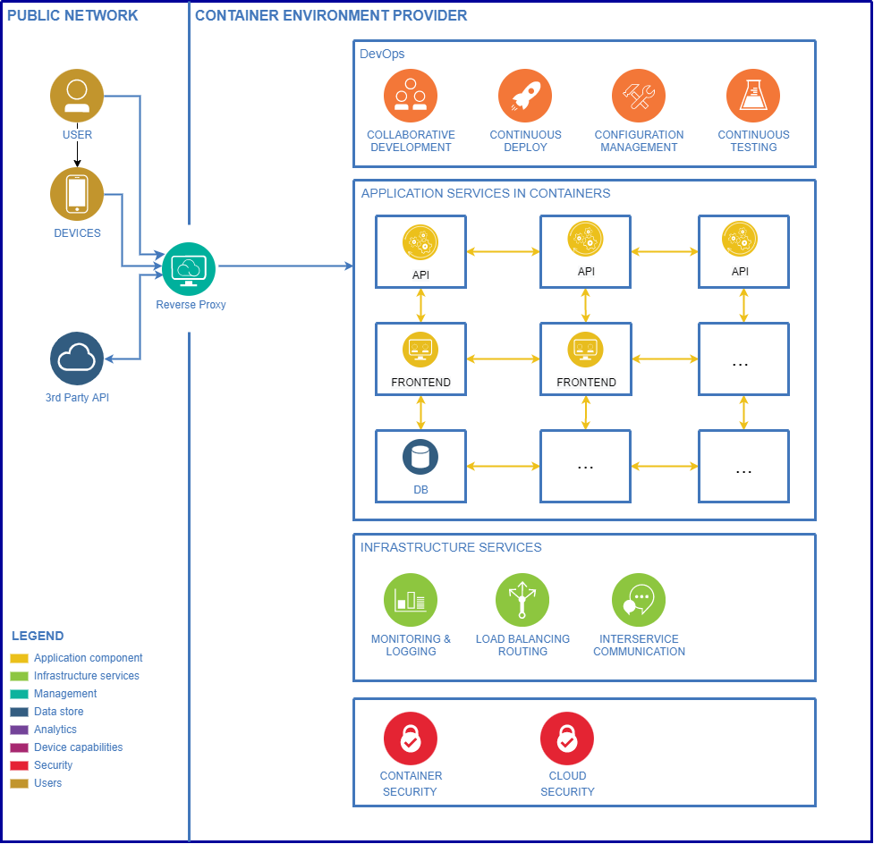

# Koch mit deinem Kühlschrank - Rezepte für deine Reste *(Captain Cook)*

Dokumentation für das Projekt *Captain Cook* im Rahmen des Kurses *Advanced Software Engineering* 2022 (DHBW Mannheim)
Gruppenmitglieder: Arne Kapell, Finn Callies, Irina Jörg, Akshaya Jeyaraj, Gurleen Kaur Saini

Repository: [leen001/Captain_Cook](https://github.com/leen001/Captain_Cook)

Online-version dieser Dokumentation: [MD](https://github.com/leen001/Captain_Cook/blob/main/docs/MAIN.md) | [PDF](https://github.com/leen001/Captain_Cook/blob/main/docs/MAIN.pdf)

---

# Inhaltsverzeichnis

- [Motivation](#motivation)
  - [Akteure](#akteure)
- [Architektur](#architektur)
  - [Komponentendiagramm](#komponentendiagramm)
  - [Konzept: Externer ID-Provider](#konzept-externer-id-provider)
  - [Konzept: DB-Zugriff absichern](#konzept-db-zugriff-absichern)
  - [Architektur-Entscheidungen](#architektur-entscheidungen)
  - [Funktionale Anforderungen](#funktionale-anforderungen)
    - [**User Stories**](#user-stories)
  - [Nicht-funktionale Anforderungen](#nicht-funktionale-anforderungen)
  - [Domain-Driven-Design](#domain-driven-design)
  - [Observability](#observability)
  - [Weitere Diagramme](#weitere-diagramme)
- [Deployment und Operations](#deployment-und-operations)
  - [Deployment](#deployment)
    - [**Build \& Deployment Pipeline**](#build--deployment-pipeline)
  - [Operations](#operations)
  - [Statischer Code-Report](#statischer-code-report)
- [Deep Dive: API](#deep-dive-api)

## Motivation

---

Die grundsätzliche Motivation des Projektes besteht darin dazu beizutragen, die Lebensmittelverschwendung zu verringern. Dies erfolgt indem z. B. Rezepte vorgeschlagen werden, die auf den zu Hause verbliebenen Resten basieren, und die Menschen durch leckere Rezeptempfehlungen dazu ermutigt, diese zu verwerten.

Oft bereiten Kunden eine Mahlzeit mithilfe von Koch-Websites oder Kochbüchern zu. Doch nicht immer haben sie die benötigten Zutaten zur Hand. Daher basieren die Empfehlungen des Empfehlungssystems auf Produkten, die der Kunde entweder zu Hause im Kühlschrank und im Vorratsschrank hat oder die er gerade im örtlichen Supermarkt gekauft hat. Sollte doch einmal etwas fehlen, lassen sich einzelne Zutaten direkt auf die Einkaufsliste setzen, sodass die bereits vorhandenen optimal genutzt werden können.

---

### Akteure

Die **Architekten** entscheiden über Designs und neue Funktionen des Produkts, die in Zukunft die Anwendung erweitern.

**Datenbankadministratoren** können Nutzer und deren Einkaufslisten verwalten, sollte es zu Problemen im normalen Ablauf kommen.

Die **Programmierer** setzten die Design und Funktionsvorschläge, auf die sich die Architekten geeinigt haben, in Code um.

Die **Endnutzer** sind die tatsächliche Zielgruppe der Anwendung und interagieren mit dieser, um die veröffentlichten Funktionen für sich zu verwenden. Hier kann man in zwei Arten unterscheiden:

1. Nutzer die lediglich den öffentlichen Teil der Anwendung (Rezeptsuche) verwenden (keine Authentifizierung benötigt), und
2. Nutzer die eine Einkaufsliste verwalten möchten und sich hierzu mit einem Google-Konto authentifizieren müssen.

**Google** OAuth und die zugehörige, öffentliche API zur Token Validierung werden von Google zur Verfügung gestellt und von der Anwendung in Front- und Backend (je nach Bedarf) verwendet.

Unser Deployment Target (**VPS**) dient als Host-System, damit die Anwendung im Internet über eine Webadresse erreichbar ist.

Die **Datenbank** speichert alle Daten und stellt diese wenn nötig dem Nutzer über die API und das Frontend zur Verfügung. In diesem Fall handelt es sich um *MariaDB*, eine Open-Source-Datenbank, die auf MySQL basiert.

Die **API** ist die Schnittstelle zwischen dem vom Nutzer verwendeten UI und der Datenbank um Eingaben des Nutzers in letzterer zu speichern und bei Gelegenheit wieder abzurufen.

## Architektur

---

### Komponentendiagramm

Die Architektur der Anwendung ist im oberen Diagramm dargestellt. Die Anwendung besteht aus einem Backend, welches in Python mit dem Flask-Framework implementiert wurde. Das Backend stellt eine REST-API zur Verfügung, die von einem Frontend aus genutzt wird. Das Frontend wurde dabei mit dem Flutter-Framework implementiert. Die Daten werden in einer MariaDB-Datenbank gespeichert und die Kommunikation zwischen den Komponenten erfolgt über HTTP-Requests. Zudem findet zwei Mal täglich ein Backup dieser statt.

Zusätzlich zu den Komponenten der Anwendung gibt es noch einen externen ID-Provider, der für die Authentifizierung der Benutzer zuständig ist. Die Kommunikation zwischen dem Frontend und dem ID-Provider erfolgt über OAuth2. Die erhaltenen Tokens werden von dem Backend für die Authentifizierung der Benutzer mit Hilfe der selben OAuth2-Schnittstelle validiert.

---

### Konzept: Externer ID-Provider

Wie bereits im [Komponentendiagramm](#komponentendiagramm) beschrieben, wird für die Authentifizierung der Benutzer ein externer ID-Provider verwendet. Konkret fiel die Entscheidung zu Gunsten von Google als ID-Provider aus, da hier eine große Anzahl an bereits registrierten Benutzern vorhanden ist und die Anbindung mit Hilfe bestehender Bibliotheken und Standard-Schnittstellen sehr einfach ist. Die Anbindung erfolgt über die OAuth2-Schnittstelle, die von Google bereitgestellt wird.

Im Frontend (Flutter) wird das Dart-Package [google_sign_in]([https://pub.dev/packages/google_sign_in) verwendet, um die Anmeldung zu ermöglichen und den aktuellen Status des Benutzers vorzuhalten.
Auf der API-Seite (Flask) wird das Python-Package wird der Token aus dem Frontend überprüft und die Authentizität des Benutzers und seiner Session geprüft.

Dieses Konzept erlaubt es der Anwendung ohne eigenes Session-Management auszukommen, was den Aufwand für die Implementierung deutlich reduziert. Außerdem ist es möglich, die Anwendung mit einem bestehenden Google-Account zu nutzen, was die Anmeldung vereinfacht. Schließlich führt diese Entscheidung auch zur Reduktion der Angriffsfläche, da die Anwendung nicht selbst für die Authentifizierung der Benutzer verantwortlich ist und somit nicht selbst die Passwörter der Benutzer speichern muss.

### Konzept: DB-Zugriff absichern

Um die Datenbank von unerlaubten Zugriffen zu schützen, werden die Vorteile im Container-Umfeld genutzt. Dafür lohnt sich ein Blick in die [Definition des Docker-Stacks (für die Produktiv-Umgebung)](../docker-compose.prod.yml). Vereinfacht lässt sich sagen, dass dort zwei Netzwerke existieren: ein Stack-internes (`default`) und eines für die Kommunikation nach außen (`web`). Die Datenbank ist nur im internen Netzwerk erreichbar, sodass sie nicht von außen direkt angesprochen werden kann. Die Kommunikation zwischen dem Backend und der Datenbank erfolgt über das interne Netzwerk.

### Architektur-Entscheidungen

*Warum Flask, Flutter und MariaDB? (Vergleich zu anderen Stacks)*
Es gibt viele Faktoren, die die Architekturentscheidungen in einem Projekt beeinflussen können, darunter die spezifischen Anforderungen des Projekts, die Fähigkeiten und Erfahrungen des Entwicklungsteams und die verfügbaren Ressourcen. Im Allgemeinen ist es jedoch wichtig, die verschiedenen Optionen sorgfältig zu berücksichtigen und die Werkzeuge und Technologien auszuwählen, die am besten für das anstehende Projekt geeignet sind.

Eine mögliche Architektur für ein Projekt könnte den Einsatz von Flutter für die Front-End, Flask für die Back-End und MariaDB für die Datenbank beinhalten.

**Flutter** ist ein beliebtes Open-Source-Mobile-Application-Development-Framework von *Google*. Es ermöglicht Entwicklern, native kompilierte Anwendungen für Mobilgeräte, Web und Desktop aus einem Codebasis zu erstellen. Flutter ist bekannt für seinen schnellen Entwicklungszyklus und seine Fähigkeit, schöne und expressive Benutzeroberflächen zu erstellen. Im Projekt wurde vordergründig für `web` als Ziel-Plattform entwickelt, mit geringen Ergänzungen wären dank dieser Architektur-Entscheidung aber auch Builds für u.a. `iOS`, `Android`, `Windows` und `Linux` möglich (jeweils als native Anwendung).

**Flask** ist ein Microweb-Framework für Python, das eine einfache Möglichkeit bietet um Webanwendungen zu erstellen. Es ist bekannt für seine Einfachheit und seine Flexibilität, wodurch es eine gute Wahl für das schnelle Entwickeln von Prototypen und die Erstellung kleiner bis mittelgroßer Webanwendungen ist. Flask verfügt des weiteren über eine große und aktive Community, mit vielen Bibliotheken und Plugins von Drittanbietern, die seine Fähigkeiten erweitern. Es wird verwendet, um eine API zu erstellen, die die Datenbank abfragt und die Daten an die App sendet, in der diese dann angezeigt werden. Im konkreten Projekt-Fall überwiegen die Vorteile von Flask gegenüber anderen Frameworks wie z.B. Django, da Flask für die Anwendung eine deutlich kleinere Codebasis erfordert und den "Overhead" minimiert.

**MariaDB** ist ein Fork des beliebten Datenbank-Management-Systems MySQL. Es ist bekannt für seine Kompatibilität mit MySQL sowie für seine Leistung und Zuverlässigkeit. MariaDB bietet eine Vielzahl von Funktionen und Werkzeugen zur Verwaltung und Abfrage von Daten und ist daher für viele Anwendungen geeignet.

**Docker** ist ein Open-Source-Container-Management-System, das es Entwicklern ermöglicht, Anwendungen in isolierten Containern zu erstellen, zu testen und zu veröffentlichen. Docker ist bekannt für seine Flexibilität und seine Fähigkeit, Anwendungen in einer Vielzahl von Umgebungen zu erstellen und zu verwalten. Es wird verwendet, um die Anwendung in Containern zu erstellen, die auf jedem System ausgeführt werden können, auf dem Docker installiert ist. Docker ist eine gute Wahl für das Projekt, da es die Entwicklung und das Deployment der Anwendung vereinfacht und die Anwendung in einer isolierten Umgebung ausführt, die die Anwendung vor unerwünschten Änderungen schützt.

**Portainer** ist eine Open-Source-Management-Software für Container, die es ermöglicht, Container-Umgebungen wie Docker, Swarm und Kubernetes zu verwalten und zu überwachen. Portainer bietet eine benutzerfreundliche Web-Oberfläche, über die Sie Container erstellen, ausführen und verwalten können. Mit Portainer können ist es auch möglich Container-Images erstellen, deployen und verwalten, sowie Container-Netzwerke und -Volumes managen. Portainer bietet die Möglichkeit, Container-Bereitstellungen und -Updates automatisch durchzuführen, um die Effizienz zu erhöhen

Zusammen bieten diese Technologien eine leistungsstarke und flexible Architektur für unser Projekt. Flutter kann verwendet werden, um benutzerfreundliche und ansprechende Interfaces zu erstellen. Flask bietet ein einfaches, skalierbares Back-End und MariaDB kann als zuverlässige und leistungsstarke Datenbank dienen.

### Funktionale Anforderungen

Für die funktionalen Anforderungen wurden vier **Use-Cases** definiert. Diese sind:

**Use Case 1**

1. Beschreibung:

- Die Anwendung muss es Benutzern ermöglichen, Rezepte abzufragen.

2. Aktoren:

- Benutzer
- Datenbank
- API-Verbindung
- Website-Host

3. Voraussetzungen:

- Aktive Verbindung zum Internet
- Rezepte in der DB vorhanden
- API muss erreichbar sein

4. Grundlegender Ablauf der Ereignisse:

- Vorgang beginnt mit Eingabe von Zutaten im Suchfeld
- Anfrage an Datenbank versendet
- Abgleich eingegebene Zutaten mit Zutaten in der Datenbank
- Bestätigung wenn Zutaten in Datenbank vorhanden
- Zutaten an API mit POST Befehl
- Antwort der API mit 5 Rezeptvorschlägen
- Anzeigen der ausgegebenen Rezeptvorschläge

**Use Case 2**

1. Beschreibung:

- Die Anwendung muss es Benutzern ermöglichen, Bewertungen für Rezepte hinzuzufügen.

2. Aktoren
   Benutzer
   Datenbank
   API-Verbindung
   Webseiten-Host
   Google API-Verbindung
3. Voraussetzungen
   Verbindung zum Internet steht, damit verbunden auch:

- Muss der Google-API Endpoint ansprechbar sein
- erfolgreiche Anmeldung mit bestehendem Google-Account durchgeführt
- Website mit funktionierender API-Verbindung zur Datenbank

4. Grundsätzlicher Ablauf

- Vorgang beginnt mit Aufruf der Website
- Usecase 4 wird durchgeführt
- Usecase 1 wird ausgeführt
- Rezepte mit aktuell bestehenden Bewertungs-Score werden abgerufen
- Benutzer wählt anhand der Sternen-Ansicht seine Anzahl an Sternen aus
- API POST Befehl wird durchgeführt, während dessen keine andere API Anfrage möglich
- Gesendeter Wert wird mit bestehendem verrechnet
- Neuer Bewertungs-Score wird angezeigt

5. Alternative Abläufe

- Zeitgleiche Bewertung:

  - Wenn die Anfrage, die Bewertung zu setzen, ausgeführt wird, bevor eine andere API-Anfrage, wie beispielsweise das Hinzufügen einer Zutat zur Einkaufsliste, vollständig ausgeführt wurde, dann
    - bricht die Anfrage mit einer Fehlermeldung ab
    - Bewertung kann nicht abgegeben werden
- wiederholte Bewertung:

  - Wenn eine Bewertung für das ausgewählte Rezept bereits abgegeben wurde, kann eine erneute Bewertung nicht ausgeführt werden, dann
    - wird eine Fehlermeldung dargestellt, dass eine Bewertung von diesem Benutzer schon abgegeben wurde

6. Schlüssel-Szenario

- Website liefert keine Rückmeldung zu Ereignissen

7. Nachbedingungen

- Erfolgreiche Durchführung: Bewertung für Rezept abgegeben
- Fehlgeschlagene Durchführung: Log-Einträge wurden entsprechend aktualisiert.

Grundlegender Ablauf der Ereignisse

**Use Case 3**

1. Die Anwendung muss es Benutzern ermöglichen, Gegenstände der Einkaufsliste hinzuzufügen.
2. Aktoren

- Nutzer
- Datenbank
- API

3. Voraussetzungen

- Aktive Internetverbindung des Nutzers
- Webseite muss erreichbar sein
- Nutzer muss angemeldet sein (siehe Usecase 5)

4. Grundlegender Ablauf der Ereignisse

- Einkaufsliste des Nutzers wird über die API aus der Datenbank geholt
- Eingabe des Nutzers in das Textfeld
- API Call
- hinzufügen des Gegenstands in die Einkaufsliste des korrekten Nutzers in der Datenbank

**Use Case 4**

1. Die Anwendung muss es Benutzern ermöglichen, Gegenstände aus der Einkaufsliste zu entfernen.
2. Aktoren

- Nutzer
- Datenbank
- API

3. Voraussetzungen

- Aktive Internetverbindung des Nutzers
- Webseite muss erreichbar sein
- Nutzer muss angemeldet sein (siehe Usecase 5)

4. Grundlegender Ablauf der Ereignisse

- Einkaufsliste des Nutzers wird über die API aus der Datenbank geholt
- Löschen eines Gegenstands vom Nutzer über das UI
- API Call
- entfernen des Gegenstands aus der Einkaufsliste des korrekten Nutzers in der Datenbank

**Use Case 5**

1. Die Anwendung muss es Benutzern ermöglichen, sich anzumelden.
2. Aktoren

- Nutzer
- Google OAuth
- public API

3. Voraussetzungen:

- Aktive Internetverbindung des Nutzers
- Webseite muss erreichbar sein
- Google OAuth muss erreichbar sein
- public API muss erreichbar sein

4. Grundlegender Ablauf der Ereignisse

- Nutzer wählt den SignIn Button
- Weiterleitung zu Google OAuth
- Token Validierung über die public API

5. Alternative Abläufe

- Nutzer besitzt kein Google Konto und wird nicht in der Lage sein sich anzumelden

**Use Case 6**

1. Die Anwendung muss es Benutzern ermöglichen, sich abzumelden.
2. Aktoren

- Nutzer
- Google OAuth
- public API

3. Voraussetzungen:

- Aktive Internetverbindung des Nutzers
- Webseite muss erreichbar sein
- Nutzer muss angemeldet sein (siehe Usecase 5)

4. Grundlegender Ablauf der Ereignisse

- Nutzer wählt den SignOut Button
- Frontend Library behandelt den SignOut

#### **User Stories**

1. Als User möchte ich mithilfe der Anwendung Rezeptvorschläge abfragen und somit die Lebensmittelverschwendung verringern, indem ich zu Hause verbliebenen Resten wiederverwerte.
2. Als User möchte ich Rezepte bewerten, um meine Meinung zum Rezept zu äußern aber auch Verbesserungsvorschläge für andere Nutzer zu hinterlassen. Dadurch möchte ich auch einen Austausch mit anderen Nutzern der Anwendung haben und ermöglichen.
3. Als User möchte ich eine Einkaufsliste verwenden, um nicht vorhandene Zutaten hinzuzufügen, womit ich mir Zeit und Geld spare und Lebensmittelverschwendung vorbeugen kann.
4. Als User möchte ich die Möglichkeit haben mich an- und abzumelden, um Funktionen wie das Bewerten von Rezepten und das Erstellen bzw. Verwalten einer Einkaufsliste zu nutzen.

### Nicht-funktionale Anforderungen

*Skalierbarkeit, Authorization, jeweils mit Implementierung*

Die genutzten Container-Technologien ermöglichen ein einfaches Skalieren (sowohl horizontal als auch vertikal) von UI und API.

MariaDB ist eine Open-Source-Datenbank, die skalierbar ist, indem sie die Verwendung von Clustering und Replikation ermöglicht, um die Leistung und Verfügbarkeit zu verbessern. Dies bedeutet, dass MariaDB in der Lage ist, Daten auf mehreren Servern zu speichern und zu verarbeiten, um die Belastung zu verteilen und die Leistung zu erhöhen.

Flask ist ein leichtgewichtiges Web-Framework für Python, das skalierbar ist, indem es die Verwendung von Front-End-Caching und Load Balancing ermöglicht. Dies bedeutet, dass Flask in der Lage ist, die Last auf mehrere Server zu verteilen und gecachte Daten zu verwenden, um die Leistung zu verbessern.

Flutter ist ein Open-Source-Framework für die Entwicklung von mobilen Anwendungen, das skalierbar ist, indem es die Verwendung von Hot Reload und Hot Restart ermöglicht. Dies bedeutet, dass Flutter in der Lage ist, schnell Änderungen im Code zu übernehmen und die Anwendung ohne Verlust des Zustands neu zu starten, wodurch die Entwicklungszeit verkürzt und die Leistung verbessert wird.

Insgesamt sind MariaDB, Flask und Flutter in der Lage, in einem Container skaliert zu werden, indem verschiedene Techniken und Funktionen verwendet werden, um die Leistung und Verfügbarkeit zu verbessern. Die genauen Details und Möglichkeiten hängen jedoch von der spezifischen Implementierung und den Anforderungen der Anwendung ab.

Um registrierten Nutzern eine Datensicherheit zu bieten wird HTTPS für für Basis-Verschlüsselung zwischen Client und Server (UI und API) genutzt.
Um weitere (Web-)Schwachstellen abzudecken, soll sich an den OWASP Top 10 als Katalog orientiert werden.

Eine weitere wichtige Nicht-funktionale Anforderung ist die Benutzerfreundlichkeit. Diese soll durch eine intuitive, einfache und übersichtliche UI umgesetzt werden. Daraus resultierend soll auch der Funktionsumfang auf das minimale beschränkt werden.

Ausfallsicherheit und Redundanz ist über Backups sowie Notfall-Instanzen der Datenbank abzudecken, falls die Haupt Instanz ausfallen sollte.

Ausblick: Mit MariaDB Enterprise ist die Anzahl der Kerne, der Arbeitsspeicher und die Speicherkapazität leicht zu erhöhen.
Um eine horizontale Skalierung zu gewährleisten können auch mehrere Instanzen genutzt werden.
Das nicht vorhandene Budget für dieses Projekt verhindert allerdings den Einsatz einer MariaDB Enterprise Lizenz.

---

### Domain-Driven-Design

Wie veranschaulicht besteht unser Design aus 3 Domains: Rezept-Daten, Einkaufsliste und Such-Domäne (Such-Ausgabe).

Die Unterteilung und Modellierung hat uns geholfen, das Verständnis der Prozesse und Anforderungen in diesen Bereichen zu vertiefen und sicherzustellen, dass die entwickelte Softwarelösung effektiv auf diese Prozesse und Anforderungen abgestimmt ist.

Während große Teile der Anwendung von ihrer Architektur im klassischen, "Service-Oriented-Architecture"-Stil operieren, ist die Einkaufsliste-Domäne eine "Event-Driven-Architecture". Dies bedeutet, dass die Einkaufsliste-Domäne auf Ereignisse reagiert, die von der Rezept-Domäne ausgelöst werden. Dies ermöglicht es uns, die Einkaufsliste-Domäne von der Rezept-Domäne zu trennen und die Einkaufsliste-Domäne unabhängig von der Rezept-Domäne zu entwickeln. Beispielsweise lassen sich Zutaten aus einem Rezept der eigenen Einkaufsliste hinzufügen, ohne dass die Rezept-Domäne davon Kenntnis nehmen muss. Man kann gleichzeitig jedoch auch ein Element zur Einkaufsliste hinzufügen, das gar nicht in einem Rezept enthalten ist. Und auch beim Löschen eines Rezepts wird die Einkaufsliste nicht beeinflusst.

---

### Observability

*Logging, Monitoring, Tracing*

Observability ist aktuell in einem stark eingeschränkten Rahmen umgesetzt. Bei der jetzigen Anwendungsgröße und -komplexität ist es nicht notwendig, umfangreiche Observability-Tools einzusetzen. Die einzelnen Container der App werden gemeinsam als *Stack* mit Hilfe von Docker-Compose auf einem VPS mit Docker als Container Environment gestartet und auf selbigem mittels **Portainer**, einem selbst vollständig containerisierten Tool für Management und Monitoring von Container-Hosts, überwacht. Man erhält dabei grundlegende Einblicke in Logs, Metriken und die Container selbst. Natürlich werden z.B. Logs nicht annähernd so gut aufbereitet wie bei einem professionellen Tool, aber es reicht für Entwicklungs-Zwecke wie Debugging und Monitoring aus.

*Dashboard Ansicht des Containers auf dem die REST API gehostet ist*

*Dashboard Ansicht des Datenbank Containers*

Bei Weiterentwicklung der Anwendung und einem perspektivischem Produktiv-Betrieb soll aber  Observability in größerem Maßstab mit Hilfe verschiedener Tools ermöglicht werden.
Im folgenden werden diese näher beschrieben:

**Prometheus** ist ein Open-source Tool dessen Aufgabe es in diesem Projekt ist Metriken zur Weiterverarbeitung zu sammeln.
Das System wird verwendet um die Verfügbarkeit und Leistung von Anwendungen und Diensten im laufenden Betrieb zu überwachen. Es sammelt Daten aus verschiedenen Quellen und stellt sie in einem leicht zugänglichen Format bereit, damit Entwickler die Leistung ihrer Systeme im Auge behalten und eventuelle Probleme schnell identifizieren und beheben zu können.

**Jaeger** ist wie Prometheus ein Open-Source-System, zuständig für *Tracing*. Es wird  vor allem für Monitoring und Troubleshooten von Systemen verwendet.
Funktionen die es beinhaltet sind Tracing, um die Leistung von Anwendungen zu verfolgen und zu verstehen, wie sie auf Anfragen reagieren, sowie Metriken und Alerting, um die  Leistung von Anwendungen zu überwachen.

Die Auswahl des Tools für Tracing fiel auf Jaeger da es Open Source und kostenlos ist, was es für unser Projektumfang attraktiv macht. Jaeger bietet wie beschrieben Funktionen für Tracing, Metriken und Alerting und ist einfach zu integrieren und zu verwenden, vor allem durch eine umfassende Dokumentation und Ressourcen.

Jaeger unterstützt verschiedene Tracing-Protokolle, wie z.B. OpenTracing, OpenCensus und Zipkin, was es Entwicklern ermöglicht, die für sie geeignetste Lösung zu wählen und sie leicht in ihre Anwendungen zu integrieren. Zudem bietet dieses Tool eine benutzerfreundliche Benutzeroberfläche, die es ermöglicht, Traces in Echtzeit zu visualisieren und zu analysieren, um eventuelle Probleme schnell zu identifizieren und beheben zu können.

**Logstash** ist ein Open-Source-Tools, das verwendet wird, um Log-Daten zu sammeln, zu verarbeiten und in einem Format bereitzustellen, welches die Weiternutzung vereinfacht. Es kann verwendet werden, um Logs von verschiedenen Quellen zu sammeln und in einem zentralen Repository zu speichern, sodass Entwickler leicht auf die Log-Daten zugreifen und sie verwenden können.

---

### Weitere Diagramme

*Zustandsdiagramm: Benutzer*

*Sequenzdiagramm: Benutzer löschen*

Zur  Erhaltung der Konsistenz bei der Entfernung eines Benutzers werden Datenbank Einträge gelöscht. Dabei sind Komponenten wie die Einkaufsliste oder Bewertungen von der Entfernung des Users betroffen. Da die Einkaufsliste nicht zwischen Usern geteilt wird, bleibt bei der Löschung dieser die Konsistenz erhalten. Bei  Bewertungen werden Ersteller durch "Entfernter Benutzer" ersetzt um eine sauber Trennung zu ermöglichen.

## Deployment und Operations

---

### Deployment

Für das Deployment haben wir uns für einen VPS als Zielumgebung entschieden. Ein VPS (Virtual Private Server) ist ein virtueller Server, der in einer Cloud-Umgebung betrieben wird. Im Gegensatz zu einem physischen Server teilt sich ein VPS eine Hardware-Infrastruktur mit anderen VPS, wodurch er kostengünstiger und flexibler ist. Ein VPS bietet die Leistung und Kontrolle eines dedizierten Servers, ist aber weniger teuer und einfacher zu verwalten.

Beim Deployment der Anwendung auf einem VPS wird die Anwendung zunächst auf einem lokalen Entwicklungssystem entwickelt und getestet (siehe [docker-compose.yml](../docker-compose.yml)). Sobald die Anwendung bereit ist, wird sie auf den VPS hochgeladen und dort installiert. Der VPS bietet eine gesicherte und isolierte Umgebung, in der alle Komponenten der App betrieben werden können. Die Anwendung kann dann über das Internet von jedem Endgerät aus aufgerufen werden.

Um die einzelnen Services (Frontend, API, Datenbank) gemeinsam zu starten, verwenden wir Docker-Compose. Docker-Compose ist ein Tool, das es Entwicklern ermöglicht, mehrere Docker-Container zu starten und zu verwalten. Docker-Compose verwendet dabei eine Konfigurationsdatei, in der die einzelnen Container definiert werden. Auf diese Weise wird das Deployment der Anwendung vereinfacht und beschleunigt.

#### **Build & Deployment Pipeline**

Die Build & Deployment Pipeline für dieses Projekt wurde mit Hilfe von GitHub Actions realisiert. GitHub Actions ist ein Tool, mit dem man automatisierte Workflows erstellen kann, die auf Ereignisse in einem GitHub-Repository ausgelöst werden. Dadurch kann man zum Beispiel automatisch einen Build-Prozess starten, wenn Änderungen in einem bestimmten Branch vorgenommen werden. Die erstellte Build-Version kann dann auf einem VPS oder in einer Cloud-Umgebung bereitgestellt werden, wobei auch hier wieder automatisierte Workflows genutzt werden können. GitHub Actions erleichtert das Erstellen und Verwalten von Build- und Deployment-Pipelines, indem es möglich ist, alles in einem GitHub-Repository zu konfigurieren und zu verwalten.

Um Deployment mit GitHub Actions zu nutzen, müssen Entwickler zunächst einen Workflow in ihrem GitHub-Repository erstellen. Dieser Workflow besteht aus einer Reihe von Schritten, die in einer bestimmten Reihenfolge ausgeführt werden, um den Code bereitzustellen. Jeder Schritt kann dabei ein eigenes Skript oder eine Aktion von GitHub sein, die eine bestimmte Aufgabe ausführt.

Unser Deployment-Workflow mit GitHub Actions sieht wie folgt aus:

---

### Operations

Wie im obigen *Operational Model* erkennbar, besteht die Anwendung im Deployment aus einem weiteren Service (neben den drei bereits ausführlich beschriebenen): einem Reverse Proxy. Dieser ist für die Verwaltung der Anfragen an die Anwendung zuständig. Er leitet die Anfragen an die jeweiligen Services weiter und stellt die Anwendung für den Zugriff von außen bereit. Der Reverse Proxy ist ein weiterer Docker-Container, der auf dem VPS installiert ist und dort auch von anderen Projekten mitgenutzt werden kann.

Konkret handelt es sich um eine *traefik*-Instanz, die speziell annotierte Container automatisch erkennt und als Service bereitstellt. Dabei übernimmt der Reverse Proxy die Aufgabe des Load Balancers, indem er die Anfragen an die verschiedenen Services verteilt. Zusätzlich ermöglicht er automatische Verwendung von HTTPS, indem er automatisch Zertifikate von Let's Encrypt anfordert und diese für die Anwendung konfiguriert. Die beiden Container `web` (Flutter) und `api` (Flask) sind dadurch unter den URLs [`https://captain-cook.big-sala.me/`](https://captain-cook.big-sala.me/) bzw. [`https://captain-cook-api.big-sala.me/`](https://captain-cook-api.big-sala.me/) erreichbar, ohne dass die Container selbst einen Port öffnen müssen.

---

### Statischer Code-Report

*SonarQube* ist eine Plattform für statische Codeanalyse, die Entwicklern dabei hilft, die Qualität und Sicherheit ihres Codes zu verbessern. Es bietet eine Reihe von Werkzeugen und Plugins, die es Entwicklern ermöglichen, ihren Code auf Fehler, Schwachstellen und potenzielle Verbesserungen zu überprüfen.

SonarQube unterstützt eine Vielzahl von Programmiersprachen, darunter Java, C#, C/C++, JavaScript und viele mehr. Es bietet auch eine integrierte Oberfläche, in der Entwickler die Ergebnisse der Codeanalyse anzeigen und verstehen können.

Eines der Hauptmerkmale von SonarQube ist seine Fähigkeit, Entwicklern zu helfen, die Qualität und Zuverlässigkeit ihres Codes zu verbessern, indem es sie auffordernde Regeln und Best Practices für die Code-Entwicklung hinweist. Dies kann dazu beitragen, dass der Code sauberer, wartbarer und zuverlässiger wird.

Insgesamt ist SonarQube eine leistungsstarke Plattform für die statische Codeanalyse, die Entwicklern dabei hilft, die Qualität und Sicherheit ihres Codes zu verbessern und gleichzeitig die Effizienz ihrer Entwicklungsprozesse zu steigern.

---

## Deep Dive: API

Die API liefert abhängig von der erhaltenen Such-Eingabe, Rezepte zurück sowie einen Ähnlichkeitswert. Aktuell bedient sich die API dabei an einem Datensatz fester Größe, der etwa 2000 Rezepte umfasst. Um Rezeptempfehlungen zu geben wird die Ähnlichkeit zwischen den Rezepten und der Such-Eingabe ermittelt. Hierfür wird die Cosinus-Ähnlichkeit genutzt. Die Cosinus-Ähnlichkeit ist ein Maß für die Ähnlichkeit zwischen zwei Vektoren. Sie ist definiert zwischen zwei Vektoren $a$ und $b$ als:

$$
cos(a,b) = \frac{a*b}{(|a|*|b|)}
$$

Dabei ist a*b die Skalarprodukt von $a$ und $b$ und $|a|$ die Länge des Vektors $a$ und $|b|$ die Länge des Vektors $b$. Dabei wird ein Vektor jeweils durch ein Rezept aus dem Datensatz repräsentiert und der andere durch die Such-Eingabe.

Um die Rezepte als Vektor zu repräsentieren, wird jede Zutat eines Rezeptes als eine Komponente des Vektors dargestellt. Um diese Darstellung zu ermöglichen wurde der TF-IDF Vectorizer verwendet. Dieser berechnet die Term-Frequency (TF) und die Inverse Document Frequency (IDF) für jede Zutat eines Rezeptes. Es wird also somit jeder Zutat ein Gewicht, abhängig von der Häufigkeit, der Zutat im spezifischen Rezept und der Häufigkeit in allen Rezepten. Somit wird garantiert dass, auch nicht häufig vorkommende Zutaten berücksichtigt werden. Auf diese weise wurde ein TF-IDF-Modell trainiert, dass allen Zutaten eine Gewichtung nach deren Relevanz zugeordnet. Im weiteren Verlauf kann dieses Modell dazu trainiert werden auch Allergien und Intoleranzen eines Nutzers zu berücksichtigen, indem die Gewichtung der Zutaten entsprechend angepasst wird bzw. auf 0 gesetzt wird. So würden dann z.B. die Milchprodukte bei einem Laktoseintoleranten Nutzer eine niedrigere Gewichtung erhalten und die Wahrscheinlichkeit, dass ein Rezept mit Milchprodukten empfohlen wird, würde sinken. Allerdings ist dies nicht Kernfunktion des Systems und wurde daher noch nicht implementiert. Die erhaltene Gewichtung der Zutaten wird dann in einem Vektor umgewandelt, der die Rezepte repräsentiert. Auch die Such-Eingabe wird auf diese Weise in einen Vektor umgewandelt.
Anschließend kann die Cosine Similarity zwischen allen Rezepten und der Such-Eingabe berechnet werden. Desto geringer der Cosinus-Winkel zwischen den Vektoren ist, desto größer ist die Ähnlichkeit. Die Rezepte mit der höchsten Cosinus-Ähnlichkeit werden dann als Such-Ausgabe zurückgegeben und sind absteigend sortiert.
Für die Berechnung der Cosinus-Ähnlichkeit wird die Funktion cosine_similarity aus dem sklearn.metrics.pairwise Modul verwendet. Die Bibliothek sklearn ist eine Sammlung von Algorithmen für maschinelles Lernen und Data Mining in Python und bietet eine Vielzahl an Algorithmen für die Berechnung von Ähnlichkeiten. 

Des weiteren ist geplant den Datensatz noch zu erweitern und weitere Rezepte zu scrapen. Dies würde erfordern, dass das Model neu trainiert wird. Die erweitere API würde dann auch als Microservice für alle Funktionalitäten dienen.
